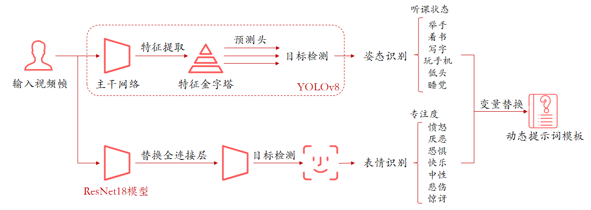
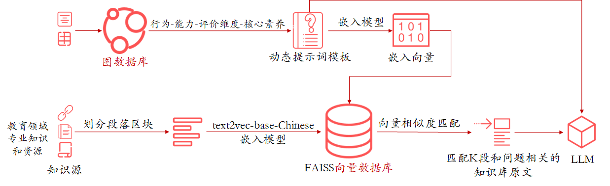
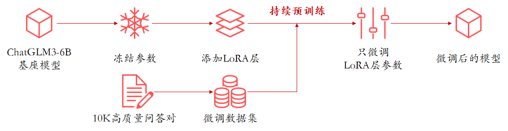
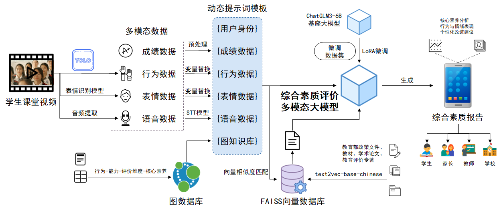
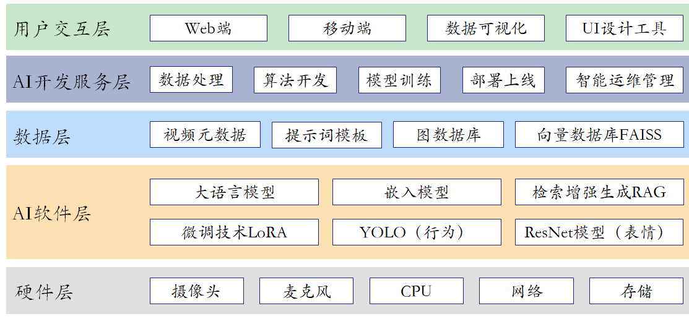

# MindReport

   MindReport是一个基于人工智能技术的教育系统，旨在通过全面收集学生课堂状态信息，利用先进的AI模型对课堂行为进行分析，最终生成学生的综合素质评价报告。该系统通过创新技术，结合多模态大模型，推动教育评价的精准化和个性化，帮助教师、家长以及教育决策者全面了解学生的成长情况。

## 核心功能与技术创新

1. **通过目标检测+表情识别技术的融合，赋能教育场景学生行为与情感的全面捕捉**
   
   在MindReport中，团队创新性地将YOLO与ResNet18技术融合，构建了一套高效的行为与表情捕捉框架。在姿态识别方面，采用先进的YOLOv8模型，通过主干网络提取图像特征并构建特征金字塔，精准捕捉不同尺度的学生动作（如举手、看书、写字等），从而反映学生的课堂参与度和听课状态。

   
2. **适配知识库技术，优化教育模型生成内容的准确性和可靠性**

   在MindReport中，团队引入知识库技术，构建了一套知识驱动的内容生成框架。在项目中，采用了“向量数据库”和“图数据库”的混合型知识库结构设计。通过这种方式，RAG技术不仅有效减少了大模型可能出现的“幻觉”现象，还增强了模型的可解释性，使输出结果更加可信且易于用户验证，为教育评价提供了有力支持。
   

3. **LoRA微调技术**

   在MindReport中，团队创新地将LoRA微调技术，适配于教育场景，构建了一套高效的模型优化框架。通过大模型微调技术不仅加快了模型的训练速度，还有效降低了过拟合的风险，使得模型能够更好地适应教育领域的特定任务，为学生综合素质评价提供更精准的支持。
   

4. **自动化综合素质报告生成**

   在收集并处理学生课堂表现、成绩等数据后，MindReport将这些数据传输到多模态大模型ChatGLM3-9B中。该模型自动生成详尽的学生综合素质评价报告，涵盖学生的学习态度、知识掌握情况等多个维度。这些报告不仅提供了对学生的全面评价，还支持个性化定制和动态追踪，帮助教师和家长清晰了解学生的成长进程。

   

## 技术路线

MindReport围绕学生综合素质智能评价和学生综合素质报告生成任务，构建了“多模态感知+多源知识融合+大模型生成”的完整技术路线，具体可分为**多模态数据采集与解析**、**知识库构建**、**提示词模板与用户画像融合**、**大模型优化与微调生成**和**报告输出与服务部署**，五个核心模块。

1. **多模态数据采集与解析**
   
   系统以学生课堂视频为主要输入源，利用训练完成的YOLOv8模型进行行为识别（如举手、看书、写字等），通过行为可以反映出学生的课堂听课状态。同时引入表情识别ResNet18模型对学生课堂表情进行识别，通过表情可以反映出学生的专注度。音频数据通过语音识别模型进行文字转录。最终汇总形成“成绩数据、行为数据、表情数据、语音数据”四类异构信息，构建学生的多模态表现画像。
   
2. **知识库构建**

   系统采用双通道的知识增强策略。一方面，利用FAISS构建向量数据库，嵌入源包括教育部发布的《深化新时代教育评价改革总体方案》《义务教育质量评价指标》《普通高中学校办学质量评价指标》等、课堂行为评价参考语、学科教学建议、核心素养定义等文档，使用text2vec-base-chinese模型经由Ollama本地部署生成文本向量，实现高效语义匹配与检索。另一方面，基于人工标注的“行为-能力-评价维度-核心素养”层次结构，构建图数据库（GraphML格式），并通过知识元路径的方式，注入到动态提示词模板中。

3. **提示词模板与用户画像融合**

   在数据预处理阶段，系统设计动态提示词模板框架，融合用户身份（学生年级、学科、学校）与各类多模态数据，通过模板变量填充与抽象转换，将原始行为表现映射为大模型可以理解的结构性输入。通过动态提示词模板的方式，可以实现多模态数据与大模型之间的语义对齐与表达抽象。在系统运行时，各类变量将由采集到的多模态数据动态填充。该模板不仅支持通用性，还可根据用户身份进行个性化调整，实现多场景适配。同时，模板内容结合向量数据库与图谱中提取的素质评价术语、话术标准和学科建议，使提示模板在专业性与多样性之间取得平衡。

4. **大模型优化与微调生成**

   系统采用ChatGLM3-6B为基础大语言模型，通过LoRA技术进行轻量化指令微调，微调数据来源于专业教师撰写的素质评价话术、各地中小学报告范文等。结合提示词模板与向量知识库支持，模型可实现对输入数据的个性化、结构化、多维度的分析与生成。

5. **报告输出与服务部署**

   系统最终生成的综合素质评价报告涵盖学生在认知、行为、情感等多方面的成长表现，并以图文结合的方式输出。系统根据用户身份，支持面向学生、家长、教师、学校等多主体个性化展示，并可部署在本地服务器或合作学校的校园网内网环境中，确保数据安全性与交互性。

   

## 技术框架

MindReport的技术框架自下而上涵盖了从硬件基础设施到用户交互的各个关键层面，形成了一个完整、高效、智能的技术生态系统，为教育评价改革提供了坚实的技术保障与创新动力。

1. **用户交互层**
   
   用户交互层是用户直接接触和操作的层面，包括Web端、移动端、数据可视化以及UI设计工具。Web端和移动端为用户提供便捷的访问渠道，满足不同场景下的使用需求。数据可视化将复杂数据以直观形象的方式呈现，帮助用户快速理解信息。UI设计工具注重用户体验和界面美观性，提升用户操作的舒适度和满意度。
   
2. **AI开放服务层**
   AI开发服务层负责核心的AI开发与服务工作，涵盖数据处理、算法开发、模型训练、部署上线以及智能运维管理。数据处理对来自用户交互层的数据进行清洗、转换等操作，为后续分析建模提供高质量数据。算法开发设计创新算法满足特定业务需求，模型训练利用处理后的数据训练AI模型，部署上线将训练好的模型投入生产环境，智能运维管理持续监控优化模型，保障系统稳定高效运行。

3. **数据层**

   数据层提供多样化的数据支持和处理能力，包括视频元数据、提示词模板、图数据库和向量数据库FAISS。视频元数据为利用模型对视频处理后得到的参数信息，提示词模板用于，图数据库存储“行为-能力-评价维度-核心素养”层次结构，向量数据库FAISS高效处理高维向量数据，为系统提供强大的数据基础和检索能力。

4. **AI软件层**

   AI软件层包含多种AI软件技术和工具，包括大语言模型、嵌入模型、检索增强生成RAG、微调技术LoRA、YOLO和ResNet18模型。这些技术和工具共同构成了系统的核心AI能力，支持模型开发、优化、部署和运行，为上层应用提供强大的AI支持。

5. **硬件层**

   硬件层作为整个技术框架的物理基础，包括摄像头、麦克风、CPU、网络和存储等硬件资源。摄像头和麦克风用于采集学生课堂行为、表情和音频数据，CPU是系统运算核心，处理各类计算任务，网络负责数据传输与通信，保障系统各部分间高效数据交互，存储则安全保存系统数据，确保数据的可靠性和可用性。
